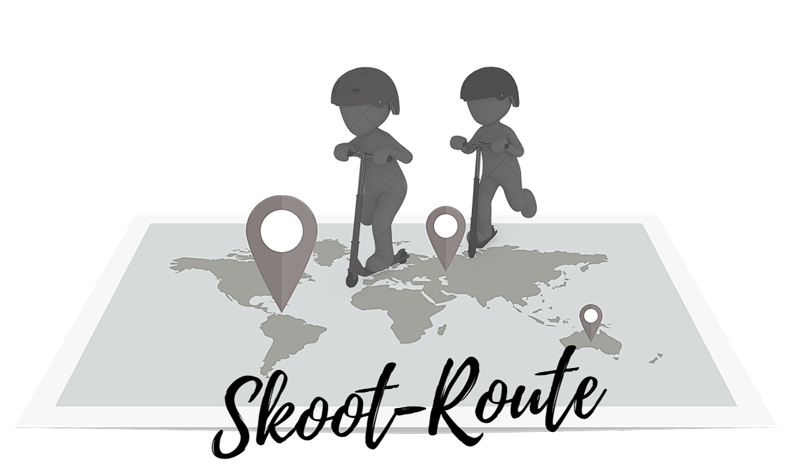

# Skoot-Route

### Code Institute / Data Centric Development Milestone Project

Tasked to create a website combining knowledge from the Python Fundamentals, Practical Python & the Data Centric Development modules on the Code Institute course.

## Introducing you to

  

#### The Idea:

Having previously created a scooter shop website for my MS2 and briefly touching on Skoot Routes within that, I decided for this project that i was going to take that idea and build on it. The site is based around Skoot routes that people can use to find unknown places around major cities while on holidays or just travelling around there own town on their scooters.

I built this website using all the content we learned on the course and more using features like EmailJS, Javascript, & Flask features.
 
#### The goal of this website is to:

Is to give people the freedom to explore unknown or popular places that people like taking their scooters for a ride and by allowing them to share it with others.
They can do this by the way of sharing their route links from google maps and by giving a brief description as to why they love it so much and hopefully encourage people to explore the unknown or hidden gems that they have found.

## User Experience

### User Stories:

1. As a user I want to easily navigate the site across all pages.

2. As a user I want to be able to have the ability to view pre-made (public) skoot routes.

3. As a user I want to sign up to a newsletter so i am kept up to date with the latest routes

4. As a user i want to be able to create, edit & delete my own routes.

5. As a user i want to be able to share my routes in a public place for others to enjoy.

6. As a user I want to view the site from any device (mobile, tablet, desktop).

## Design

The project utilises the [Bootstrap 4](https:/getbootstrap.com/) framework to ensure Mobile first fully responsive design. When considering the design elements for this project, a modern/vivid color scheme is what came to mind first.

### Font:

The project has a main font of 'Maven Pro' which was imported via css from Google Fonts, with the backup font being set to a default of 'Sans-serif'. The clean feel gave the website a modern look but also making each character very easy to read for the user.

### Logo:

The main idea of this logo was taken from this [site](https://skoot.ie/) and by using photoshop i was able to add in a few of my own elements to help me create my desired logo.
My Logo can be seen in the navbar of my site and is used as 'Home' button across all pages.

## Features

In this section, you should go over the different parts of your project, and describe each in a sentence or so.
 
### Existing Features
- Feature 1 - allows users X to achieve Y, by having them fill out Z
- ...

For some/all of your features, you may choose to reference the specific project files that implement them, although this is entirely optional.

In addition, you may also use this section to discuss plans for additional features to be implemented in the future:

### Features Left to Implement
- Another feature idea

## Technologies Used

In this section, you should mention all of the languages, frameworks, libraries, and any other tools that you have used to construct this project. For each, provide its name, a link to its official site and a short sentence of why it was used.

- [JQuery](https://jquery.com)
    - The project uses **JQuery** to simplify DOM manipulation.

## Testing

In this section, you need to convince the assessor that you have conducted enough testing to legitimately believe that the site works well. Essentially, in this part you will want to go over all of your user stories from the UX section and ensure that they all work as intended, with the project providing an easy and straightforward way for the users to achieve their goals.

Whenever it is feasible, prefer to automate your tests, and if you've done so, provide a brief explanation of your approach, link to the test file(s) and explain how to run them.

For any scenarios that have not been automated, test the user stories manually and provide as much detail as is relevant. A particularly useful form for describing your testing process is via scenarios, such as:

1. Contact form:
    1. Go to the "Contact Us" page
    2. Try to submit the empty form and verify that an error message about the required fields appears
    3. Try to submit the form with an invalid email address and verify that a relevant error message appears
    4. Try to submit the form with all inputs valid and verify that a success message appears.

In addition, you should mention in this section how your project looks and works on different browsers and screen sizes.

You should also mention in this section any interesting bugs or problems you discovered during your testing, even if you haven't addressed them yet.

If this section grows too long, you may want to split it off into a separate file and link to it from here.

## Deployment

This section should describe the process you went through to deploy the project to a hosting platform (e.g. GitHub Pages or Heroku).

In particular, you should provide all details of the differences between the deployed version and the development version, if any, including:
- Different values for environment variables (Heroku Config Vars)?
- Different configuration files?
- Separate git branch?

In addition, if it is not obvious, you should also describe how to run your code locally.

## Credits

### Content
- The text for section Y was copied from the [Wikipedia article Z](https://en.wikipedia.org/wiki/Z)

### Media
- The photos used in this site were obtained from ...

### Acknowledgements

- I received inspiration for this project from X
